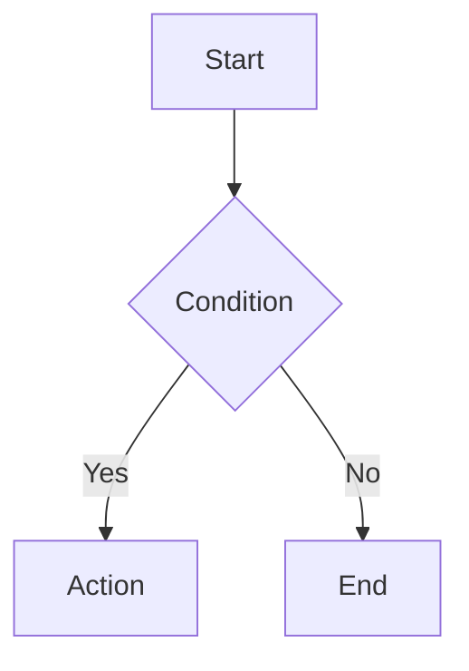
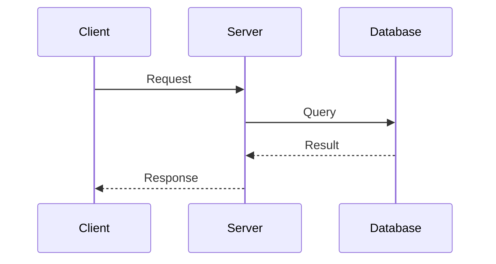
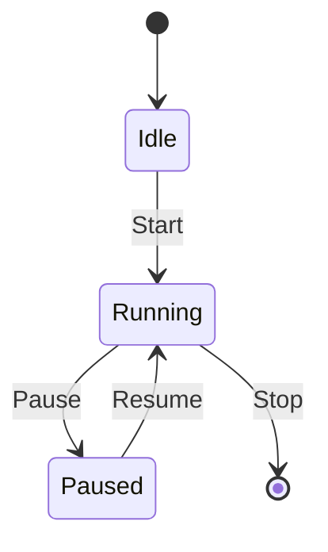
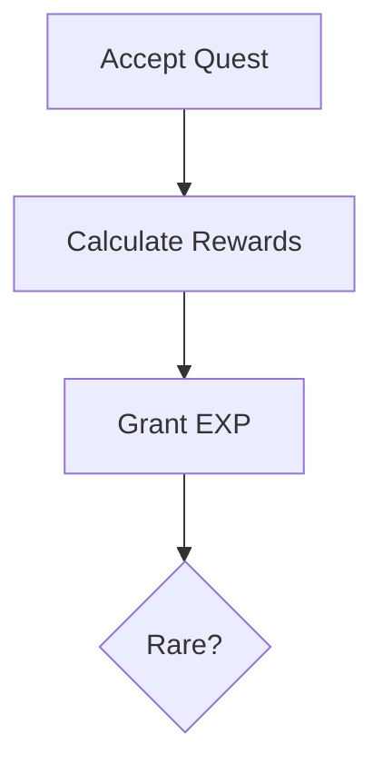
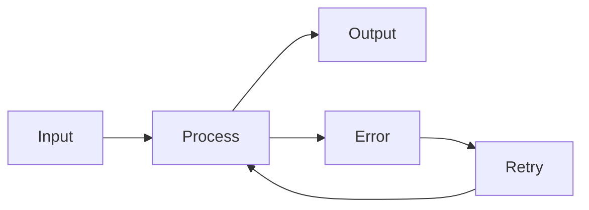

# lua-config Reference

> config.md syntax reference for config blocks, Mermaid diagrams, and probe navigation.

`lua-config` is the current fenced-block identifier for compatibility.
The product direction is language-agnostic, but block syntax remains stable while adapters evolve.

For naming conventions, see [Terminology](./terminology.md).

## Naming Conventions

- Use `config.md` when referring to the product.
- Use "Config Block" for language-neutral behavior.
- Use `lua-config` only when referring to Markdown syntax identifier and examples.
- Use "source file" unless a rule is explicitly Lua-only.

---

## Table of Contents

- [Block Syntax](#block-syntax)
- [Required Fields](#required-fields)
- [Optional Fields](#optional-fields)
- [Types](#types) — `number` · `slider` · `boolean` · `string` · `select` · `table` · `code`
- [Mermaid Diagrams](#mermaid-diagrams)
- [Probe Navigation](#probe-navigation)
- [Link Status](#link-status)
- [VS Code Settings](#vs-code-settings)
- [Quick Examples](#quick-examples)

---

## Block Syntax

A config block is a fenced code block with language `lua-config`, written in YAML:

````markdown
```lua-config
file: ./path/to/source.lua
key: Table.Key.Path
type: slider
label: Display Name
```
````

The `file` target may point to `.lua`, `.json`, or `.jsonc` today.

---

## Required Fields

| Field  | Type     | Description                        |
|--------|----------|------------------------------------|
| `file` | `string` | Relative path to the source file (`.lua`, `.json`, `.jsonc`) |
| `key`  | `string` | Dot/bracket path for target value |
| `type` | `string` | Control type (see [Types](#types))  |

---

## Optional Fields

| Field      | Type                | Applies To               | Description                      |
|------------|---------------------|--------------------------|----------------------------------|
| `storage`  | `"source"\|"markdown"` | all                   | Where values are persisted. Default: `"source"` |
| `markdown-key` | `string`        | all                      | Optional stable key for wizard/config references when `key` collisions exist |
| `value`    | `any`               | all (`storage: markdown`) | Current value stored in markdown |
| `label`    | `string`            | all                      | Display label (defaults to last segment of `key`) |
| `default`  | `any`               | all                      | Default value                    |
| `min`      | `number`            | `number`, `slider`       | Minimum value                    |
| `max`      | `number`            | `number`, `slider`       | Maximum value                    |
| `range`    | `[min, max]`        | `slider`                 | Shorthand for `min` + `max`      |
| `step`     | `number`            | `number`, `slider`       | Increment step (default: `1`)    |
| `unit`     | `string`            | `number`, `slider`       | Unit suffix displayed after the control |
| `readonly` | `boolean`           | all                      | Make the control read-only       |
| `options`  | `SelectOption[]`    | `select`                 | Dropdown options list            |
| `columns`  | `TableColumn[]`     | `table`                  | Column definitions for table     |

---

## Storage Modes

By default, config values are linked to an external source file (`storage: source`).

You can also store values directly in the current `.config.markdown` block with:

```lua-config
storage: markdown
key: LocalSettings.DebugEnabled
type: boolean
value: true
label: Debug Enabled
```

Notes:

- `storage: markdown` does **not** require `file`
- Value updates are written back to the same `lua-config` block (`value:` field)
- `key` remains required and is used as the block identity

---

## Types

### `number`

Numeric input with +/− buttons.

```lua-config
file: ./config.lua
key: Config.SpawnRate
type: number
min: 1
max: 100
step: 5
unit: "/sec"
label: Spawn Rate
```

| Param  | Type     | Default | Description       |
|--------|----------|---------|-------------------|
| `min`  | `number` | —       | Minimum allowed   |
| `max`  | `number` | —       | Maximum allowed   |
| `step` | `number` | `1`     | Increment step    |
| `unit` | `string` | —       | Unit label        |

---

### `slider`

Range slider with live value display.

```lua-config
file: ./config.lua
key: Config.Player.HP
type: slider
range: [100, 5000]
step: 100
label: Max HP
```

| Param   | Type          | Default  | Description             |
|---------|---------------|----------|-------------------------|
| `min`   | `number`      | `0`      | Slider minimum          |
| `max`   | `number`      | `100`    | Slider maximum          |
| `range` | `[min, max]`  | —        | Shorthand for min + max |
| `step`  | `number`      | `1`      | Increment step          |
| `unit`  | `string`      | —        | Unit label              |

---

### `boolean`

Toggle switch (on/off).

```lua-config
file: ./config.lua
key: Config.Settings.SoundEnabled
type: boolean
label: Enable Sound
```

No additional parameters.

---

### `string`

Text input field.

```lua-config
file: ./config.lua
key: Config.Player.Name
type: string
label: Player Name
```

No additional parameters.

---

### `select`

Dropdown select from predefined options.

```lua-config
file: ./config.lua
key: Config.Settings.Difficulty
type: select
options:
  - { value: "easy", label: "Easy" }
  - { value: "normal", label: "Normal" }
  - { value: "hard", label: "Hard" }
label: Difficulty
```

| Param     | Type              | Description         |
|-----------|-------------------|---------------------|
| `options` | `SelectOption[]`  | **Required.** List of options |

**SelectOption:**

| Field   | Type               | Description     |
|---------|--------------------|-----------------|
| `value` | `string \| number` | Stored value    |
| `label` | `string`           | Display text    |

---

### `table`

Spreadsheet-style editor for arrays of objects.

> JSON support note: `table` is now supported for JSON arrays of objects in phase 2.

```lua-config
file: ./items.lua
key: Items.Weapons
type: table
label: Weapon List
columns:
  - { key: "id",     label: "ID",     type: "number", readonly: true, width: "80px" }
  - { key: "name",   label: "Name",   type: "string", width: "150px" }
  - { key: "attack", label: "ATK",    type: "number", min: 1, max: 999, width: "120px" }
  - { key: "rare",   label: "Rarity", type: "select", width: "120px",
      options: [{ value: "common", label: "Common" }, { value: "rare", label: "Rare" }] }
```

| Param     | Type             | Description                    |
|-----------|------------------|--------------------------------|
| `columns` | `TableColumn[]`  | **Required.** Column definitions |

**TableColumn:**

| Field      | Type             | Required | Description                          |
|------------|------------------|----------|--------------------------------------|
| `key`      | `string`         | ✅       | Lua field name in each table entry   |
| `label`    | `string`         | ✅       | Column header text                   |
| `type`     | `string`         | ✅       | `"number"` `"string"` `"boolean"` `"select"` |
| `min`      | `number`         |          | Min value (number columns)           |
| `max`      | `number`         |          | Max value (number columns)           |
| `step`     | `number`         |          | Step (number columns)                |
| `options`  | `SelectOption[]` |          | Options (select columns)             |
| `readonly` | `boolean`        |          | Make column read-only                |
| `width`    | `string`         |          | CSS width (e.g. `"120px"`)           |

---

### `code`

Lua function editor — opens in VS Code's **native editor** with full language support (syntax highlighting, IntelliSense, go-to-definition, etc.). Changes are staged: click "Apply to Source" to write back.

> JSON support note: `code` is currently Lua-focused and not available for JSON.

```lua-config
file: ./game_config.lua
key: GameConfig.onPlayerDeath
type: code
label: On Player Death
```

No additional parameters. The `key` should point to a Lua function value.

**Supported function patterns:**

| Pattern | Example |
|---------|---------|
| Table field | `GameConfig = { onInit = function() ... end }` |
| Standalone declaration | `function GameConfig.onInit() ... end` |
| Colon syntax | `function GameConfig:onInit() ... end` |
| Assignment | `GameConfig.onInit = function() ... end` |

**Workflow:**

1. Preview panel shows the function source code (read-only)
2. Click **"✏️ Edit in VS Code"** → opens a temp `.lua` file in VS Code's native editor
3. Edit with full Lua language support (syntax, IntelliSense, jump-to-definition)
4. Click **"💾 Apply to Source"** in the preview panel → changes are written back to the original file

---

### `color`

> ⚠️ Declared but not yet implemented. Reserved for future use.

---

### `array`

> ⚠️ Declared but not yet implemented. Reserved for future use.

---

## Mermaid Diagrams

The preview panel natively renders [Mermaid](https://mermaid.js.org/) diagrams. Use standard fenced code blocks with language `mermaid`:

````markdown

````

**Supported diagram types:**

| Type | Keyword | Description |
|------|---------|-------------|
| Flowchart | `flowchart` / `graph` | Flow diagrams with various node shapes |
| Sequence | `sequenceDiagram` | Interaction between actors over time |
| Class | `classDiagram` | UML class diagrams |
| State | `stateDiagram-v2` | State machine diagrams |
| Gantt | `gantt` | Project timeline charts |
| Pie | `pie` | Pie charts |
| ER | `erDiagram` | Entity-relationship diagrams |
| Git Graph | `gitGraph` | Git branch visualization |

**Theme:** Mermaid automatically adapts to VS Code's current theme (light / dark).

**Example — Sequence Diagram:**

````markdown

````

**Example — State Diagram:**

````markdown

````

### Clickable Nodes (Probe Navigation in Diagrams)

You can make Mermaid nodes **clickable** so that clicking them jumps to a source code location. Use the `click` directive with a `probe://` URL:

````markdown

````

**Syntax:**

```
click NodeId "probe://./path/to/file.lua#target_name"
```

| Part | Description |
|------|-------------|
| `NodeId` | The Mermaid node identifier (e.g. `B`, `C`, `myNode`) |
| `probe://` | URL scheme (required) |
| `./path.lua` | File path relative to the Markdown file |
| `#target_name` | `@probe` marker, function path, or variable path |

Clickable nodes appear with a **pointer cursor** in the rendered diagram. The same resolution order applies: `@probe` marker → function definition → variable path.

> 💡 Mermaid blocks can be mixed freely with `lua-config` blocks, headings, and prose in the same Markdown file.

---

## Probe Navigation

Probe links let you create **clickable links** in Markdown that jump directly to specific locations in source files.

### Target Types

The `#name` part of a probe link is resolved in order:

| Priority | Target | Description |
|----------|--------|-------------|
| 1 | `@probe` marker | Comment marker `-- @probe:name` in Lua |
| 2 | Function definition | `function A.B()`, `A.B = function()`, etc. |
| 3 | Variable / table path | `A.B.C = value` (Lua) |
| 4 | JSON path | `A.B[1].C` (JSON/JSONC) |

This means you can jump to **any function or variable** without placing a probe comment — the comment is only needed for arbitrary locations (e.g. a specific line inside a function).

### Method A — Jump by Probe Marker

Add a comment with the `@probe` tag in your Lua file:

```lua
-- @probe:marker_name
```

Both colon and space separators are supported:

```lua
-- @probe:reward_calc      ← colon separator
-- @probe reward_calc      ← space separator
```

**Example:**

```lua
-- @probe:settings_def
GameConfig = {
    maxPlayers = 16,
    tickRate = 64,
}

-- @probe:damage_formula
function GameConfig.calculateDamage(attacker, target)
    local base = attacker.attack - target.defense
    return math.max(1, base)
end
```

### Method B — Jump by Function / Variable Name

No probe comment is needed. Use the function's full path directly:

```lua
-- No @probe comment needed!
function QuestSystem.onQuestComplete(player, quest)
    -- ...
end

QuestSystem.Settings = {
    MaxActiveQuests = 5,
}
```

```markdown
[Jump to onQuestComplete](probe://./quest_system.lua#QuestSystem.onQuestComplete)
[Jump to Settings table](probe://./quest_system.lua#QuestSystem.Settings)
```

### Link Syntax

Use the `probe://` URL scheme in standard Markdown links:

```markdown
[Display Text](probe://./relative/path/to/file.lua#target_name)
```

| Part | Description |
|------|-------------|
| `Display Text` | Clickable text shown to the user |
| `probe://` | URL scheme (required) |
| `./relative/path.lua` | File path relative to the Markdown file (Lua/JSON/JSONC) |
| `#target_name` | Probe marker, function path, or variable path |

**Examples:**

```markdown
See the [settings definition](probe://./game_config.lua#settings_def) for server limits.

The [damage formula](probe://./game_config.lua#GameConfig.calculateDamage) uses a base calculation.
```

### Behavior

| Context | What happens on click |
|---------|----------------------|
| **Markdown editor** (Ctrl+Click) | Opens the Lua file and scrolls to the target line |
| **Preview panel** | Renders as a `📍` link; click to jump to source |

**Smart window reuse:** When clicking a probe link in the preview panel:
1. If the target file is **already open** in an editor tab → activates that tab and scrolls
2. If not open → opens in the **same column as the Markdown source file**
3. Only falls back to a new side column if no existing column is found

### Error Handling

- If the target name is **not found** (no matching probe, function, or variable), the link appears with a ⚠️ strikethrough style in the preview panel.
- If the target **file does not exist**, no link is created.
- Probe markers are **cached** per file and refreshed automatically when the file changes.

---

## Link Status

Each block shows a status indicator:

| Status | Icon | Meaning                    |
|--------|------|----------------------------|
| `ok`             | ✅ | Lua file found, key resolved, value linked |
| `file-not-found` | ❌ | Lua file does not exist at the given path  |
| `key-not-found`  | ❌ | Key path not found in the Lua file         |
| `parse-error`    | ❌ | Lua file could not be parsed               |

---

## VS Code Settings

| Setting | Type | Default | Description |
|---------|------|---------|-------------|
| `intelligentMarkdown.autoSave` | `boolean` | `true` | Auto-save Lua file after editing |
| `intelligentMarkdown.showInlineValues` | `boolean` | `true` | Show inline value decorations |
| `intelligentMarkdown.autoOpenPreview` | `boolean` | `true` | Auto-open preview panel |
| `intelligentMarkdown.autoOpenPreviewPattern` | `string` | `**/*.config.md` | Glob pattern for auto-preview |

---

## Quick Examples

<details>
<summary><b>Slider with range</b></summary>

```lua-config
file: ./game.lua
key: Game.Player.Speed
type: slider
range: [0, 500]
step: 10
unit: "m/s"
label: Move Speed
```
</details>

<details>
<summary><b>Boolean toggle</b></summary>

```lua-config
file: ./game.lua
key: Game.Debug.Enabled
type: boolean
label: Debug Mode
```
</details>

<details>
<summary><b>Select dropdown</b></summary>

```lua-config
file: ./game.lua
key: Game.Language
type: select
options:
  - { value: "en", label: "English" }
  - { value: "zh", label: "Chinese" }
  - { value: "ja", label: "Japanese" }
label: Language
```
</details>

<details>
<summary><b>Table editor</b></summary>

```lua-config
file: ./items.lua
key: Items.List
type: table
label: Item Database
columns:
  - { key: "id", label: "ID", type: "number", readonly: true, width: "60px" }
  - { key: "name", label: "Name", type: "string", width: "150px" }
  - { key: "price", label: "Price", type: "number", min: 0, max: 99999, width: "100px" }
  - { key: "enabled", label: "Active", type: "boolean", width: "80px" }
```
</details>

<details>
<summary><b>Function editor (code)</b></summary>

```lua-config
file: ./game_config.lua
key: GameConfig.onPlayerDeath
type: code
label: On Player Death Handler
```
</details>

<details>
<summary><b>Mermaid flowchart</b></summary>

````markdown

````
</details>

<details>
<summary><b>Probe link</b></summary>

Lua file (`game.lua`):

```lua
-- @probe:init_section
function Game.init()
    -- initialization code
end
```

Markdown file:

```markdown
Jump to [initialization code](probe://./game.lua#init_section).
```

**Jump by function name (no @probe comment needed):**

```markdown
Jump to [onPlayerDeath](probe://./game_config.lua#GameConfig.onPlayerDeath).
```
</details>
