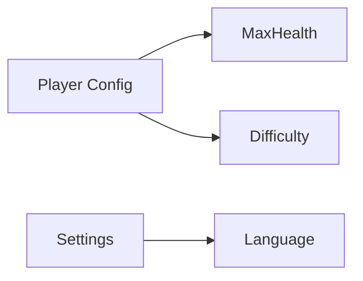

# JSON Config Fixture

This fixture validates phase-1 JSON support: value binding, probe navigation, and Mermaid click links.

## Basic Value Bindings

```lua-config
file: ./game_json_config.json
key: GameConfig.Player.MaxHealth
type: number
min: 1
max: 9999
step: 1
label: Player Max Health
```

```lua-config
file: ./game_json_config.json
key: GameConfig.Player.MoveSpeed
type: slider
range: [1, 12]
step: 0.5
label: Move Speed
```

```lua-config
file: ./game_json_config.json
key: GameConfig.Player.Name
type: string
label: Display Name
```

```lua-config
file: ./game_json_config.json
key: GameConfig.Player.EnableAutoBattle
type: boolean
label: Enable Auto Battle
```

```lua-config
file: ./game_json_config.json
key: GameConfig.Player.Difficulty
type: select
options:
  - { value: "easy", label: "Easy" }
  - { value: "normal", label: "Normal" }
  - { value: "hard", label: "Hard" }
label: Difficulty
```

## JSON Table Editing (phase 2)

```lua-config
file: ./game_json_config.json
key: GameConfig.LootTable
type: table
label: Loot Table
columns:
  - { key: "id", label: "ID", type: "number", readonly: true, width: "70px" }
  - { key: "name", label: "Name", type: "string", width: "160px" }
  - { key: "dropRate", label: "Drop Rate", type: "number", min: 0, max: 1, step: 0.01, width: "120px" }
  - { key: "enabled", label: "Enabled", type: "boolean", width: "100px" }
```

## Probe Links (JSON path)

[Jump to MaxHealth](probe://./game_json_config.json#GameConfig.Player.MaxHealth)
[Jump to Language](probe://./game_json_config.json#GameConfig.Settings.Language)
[Jump to Loot item #2 name](probe://./game_json_config.json#GameConfig.LootTable[1].name)

## Mermaid Click + JSON Path


