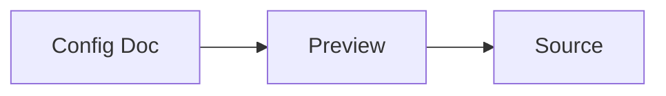

# Markdown Feature Test Suite

Use this file to validate common Markdown rendering after switching the backend parser.

---

## 1) Headings

### H3 Heading

#### H4 Heading

##### H5 Heading

###### H6 Heading

---

## 2) Paragraph and Inline Styles

This is a normal paragraph with **bold**, *italic*, and `inline code`.

Escaped characters test: \*not italic\*, \`not code\`.

---

## 3) Blockquote

> Single line quote.
>
> Multi-line quote with **inline style** and `code`.

---

## 4) Lists

- Unordered item A
- Unordered item B
  - Nested item B.1
  - Nested item B.2

1. Ordered item 1
2. Ordered item 2
3. Ordered item 3

Task-style list (plugin-dependent):
- [x] Completed task
- [ ] Pending task

---

## 5) Links

- Inline link: [VS Code](https://code.visualstudio.com/)
- Relative link: [Quest Config](../lua-config/quest_system.config.md)

---

## 6) Horizontal Rule

Below should be a horizontal separator:

---

Above should be a horizontal separator.

---

## 7) Table

| Name | Type | Value |
|---|---|---|
| MaxHP | number | 100 |
| Difficulty | select | normal |
| EnableLog | boolean | true |

---

## 8) Fenced Code Blocks

```powershell
Write-Host "Hello from PowerShell"
Get-ChildItem .
```

```json
{
  "name": "config-md",
  "version": "0.5.4"
}
```

```lua
local value = 42
print("lua:", value)
```

---

## 9) Custom Config Block

```lua-config
file: ../lua-config/player_config.lua
key: PlayerConfig.BaseStats.HP
type: slider
range: [100, 5000]
step: 100
label: Player HP
```

---

## 10) Wizard Block

```lua-wizard
file: ../lua-config/items_config.lua
target: ItemsConfig.Weapons
action: append
label: Create Test Weapon
icon: 🧪
template: |
  { id = {{id}}, name = "{{name}}", attack = {{attack}}, price = {{price}}, stackable = {{stackable}} }
steps:
  - field: id
    label: Weapon ID
    type: number
    min: 9000
    default: 9001
  - field: name
    label: Weapon Name
    type: string
    default: Markdown Test Blade
  - field: attack
    label: Attack
    type: number
    min: 1
    max: 999
    default: 77
  - field: price
    label: Price
    type: number
    min: 0
    default: 123
  - field: stackable
    label: Stackable
    type: boolean
    default: false
```

---

## 11) Mermaid Diagram



---

## 12) Probe Links

[Jump to Quest Settings Definition](probe://../lua-config/quest_system.lua#quest_settings)

[Jump to Reward Table](probe://../lua-config/quest_system.lua#reward_table)

---

## 13) Raw HTML (Allowed by Current Renderer)

<details>
  <summary>Click to expand</summary>
  <p>Raw HTML block render test.</p>
</details>

