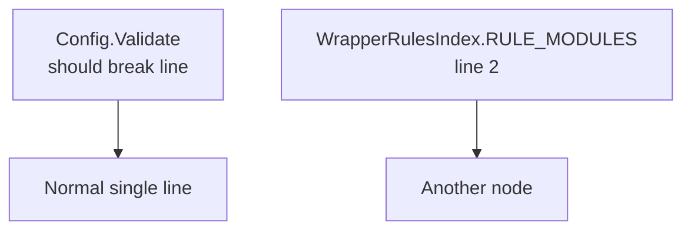

# Mermaid Escaped Newline Fixture

用于验证 Mermaid 标签中的 `\n` 是否会被渲染为换行，而不是显示原始字符串。

```mermaid
flowchart TD
    A["Config.Validate\nshould break line"] --> B["Normal single line"]
    C["WrapperRulesIndex.RULE_MODULES\nline 2"] --> D["Another node"]
```

验证点：

- `A` 和 `C` 的标签应显示为两行。
- 页面中不应看到原始的 `\n` 文本。
