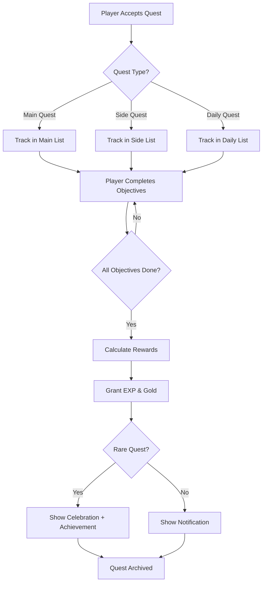
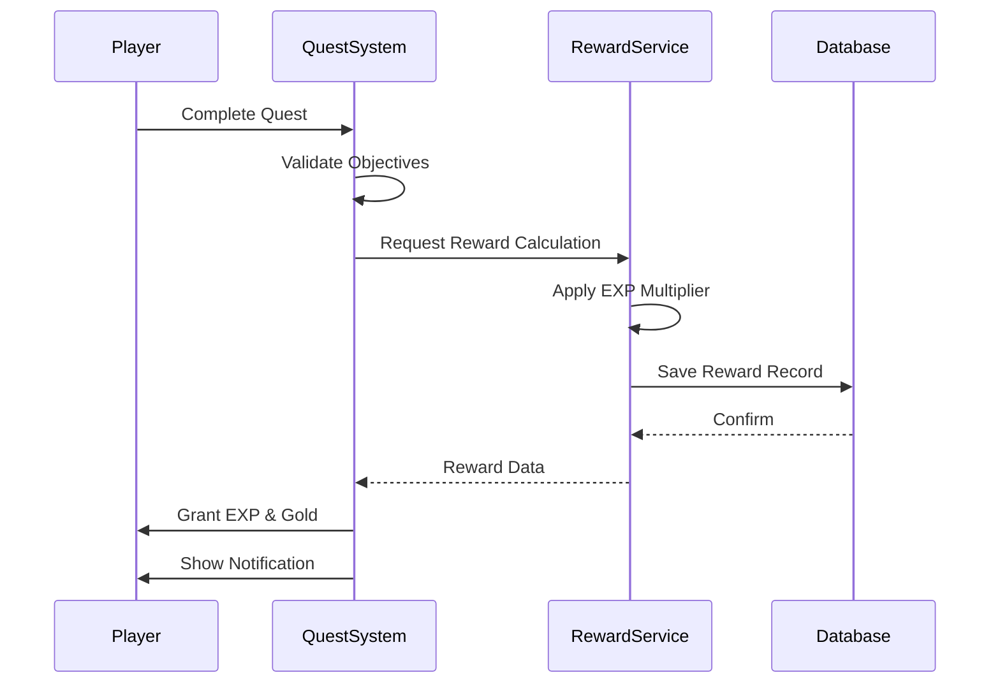
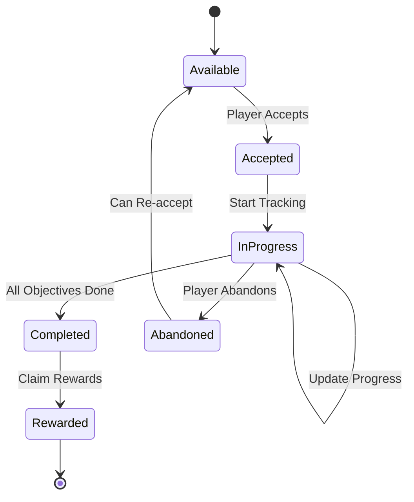

# Quest System Configuration

This document manages the quest system. It includes architecture diagrams powered by **Mermaid**, editable config controls, and **probe links** for quick code navigation.

## Quick Navigation

> Use probe links to jump directly to key locations in the source code:

- [Quest Settings Definition](probe://./quest_system.lua#quest_settings) — where the QuestSystem table is defined
- [Reward Table](probe://./quest_system.lua#reward_table) — reward configuration data
- [Quest Complete Handler](probe://./quest_system.lua#quest_complete_handler) — the main completion callback
- [EXP Calculation Logic](probe://./quest_system.lua#exp_calculation) — how experience is calculated
- [Rare Quest Logic](probe://./quest_system.lua#rare_quest_logic) — special handling for rare quests

## System Architecture

> The following diagram illustrates the overall quest lifecycle:



## Quest Settings

### Max Active Quests

> Players can only track a limited number of quests at a time to prevent UI clutter.

```lua-config
file: ./quest_system.lua
key: QuestSystem.Settings.MaxActiveQuests
type: slider
min: 1
max: 20
step: 1
label: Max Active Quests
```

### Auto Track

```lua-config
file: ./quest_system.lua
key: QuestSystem.Settings.AutoTrack
type: boolean
label: Auto Track New Quests
```

### Show Notifications

```lua-config
file: ./quest_system.lua
key: QuestSystem.Settings.ShowNotifications
type: boolean
label: Show Quest Notifications
```

### EXP Multiplier

```lua-config
file: ./quest_system.lua
key: QuestSystem.Settings.ExpMultiplier
type: number
min: 0.5
max: 5.0
step: 0.1
label: EXP Multiplier
```

### Difficulty

```lua-config
file: ./quest_system.lua
key: QuestSystem.Settings.Difficulty
type: select
options:
  - { value: "easy", label: "Easy" }
  - { value: "normal", label: "Normal" }
  - { value: "hard", label: "Hard" }
  - { value: "nightmare", label: "Nightmare" }
label: Quest Difficulty
```

## Reward Processing Flow

> How the reward system calculates and distributes rewards:



## Reward Table

```lua-config
file: ./quest_system.lua
key: QuestSystem.Rewards
type: table
label: Quest Rewards Table
columns:
  - { key: "id", label: "ID", type: "number", readonly: true, width: "80px" }
  - { key: "name", label: "Quest Name", type: "string", width: "160px" }
  - { key: "exp", label: "EXP", type: "number", min: 0, max: 99999, step: 50, width: "100px" }
  - { key: "gold", label: "Gold", type: "number", min: 0, max: 99999, step: 10, width: "100px" }
  - { key: "rare", label: "Rare", type: "boolean", width: "80px" }
```

## Quest Completion Handler

```lua-config
file: ./quest_system.lua
key: QuestSystem.onQuestComplete
type: code
label: Quest Completion Callback
```

## Quest State Machine

> The state transitions for a single quest instance:



## Instructions

- **Probe Links**: Click `📍` links to jump directly to specific locations in the Lua source code
  - Lua format: `-- @probe:marker_name`
  - Markdown format: `[text](probe://./file.lua#marker_name)`
- **Mermaid Diagrams**: Architecture and flow diagrams are rendered automatically in the preview panel
- **Config Controls**: Edit quest settings directly with sliders, toggles, and dropdowns
- **Reward Table**: Batch edit quest rewards in the table view
- **Code Editor**: Modify the quest completion callback with full syntax highlighting
