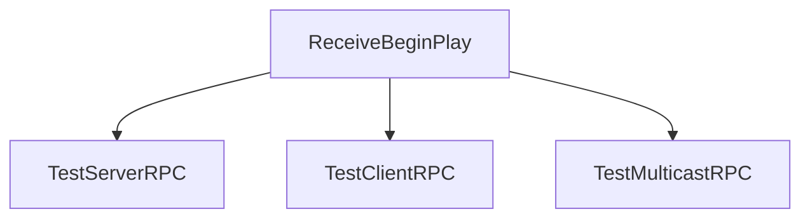

# slua-unreal LuaGameState Probe Fixture

This fixture demonstrates probe navigation patterns against `slua-game-state.lua`.

## Function path links

[Jump to ctor](probe://./slua-game-state.lua#LuaGameState.ctor)
[Jump to server RPC test](probe://./slua-game-state.lua#LuaGameState.TestServerRPC)
[Jump to begin play](probe://./slua-game-state.lua#LuaGameState.ReceiveBeginPlay)
[Jump to replicated props](probe://./slua-game-state.lua#LuaGameState.GetLifetimeReplicatedProps)
[Jump to HP replication handler](probe://./slua-game-state.lua#LuaGameState.OnRep_HP)

## Mermaid click links

